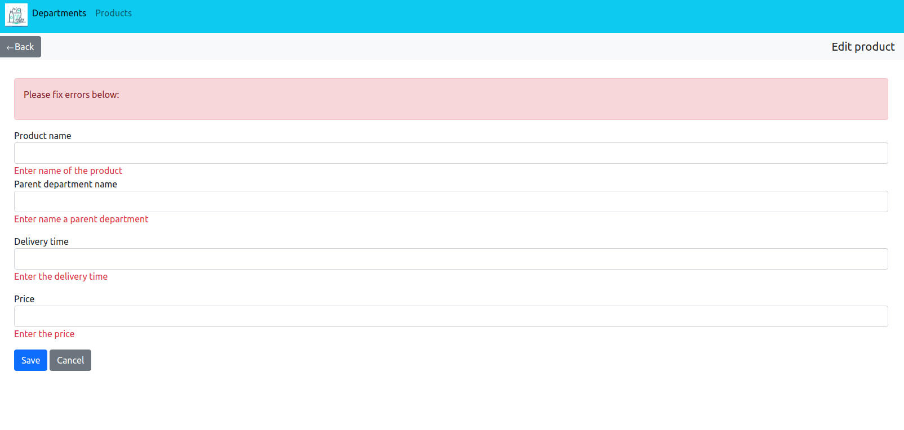

# About project
***
#### This app track, editing shop departments and products.

## Departments

#### 1.Have criterion: 
* Name(changes) 
* Assortment(changes automatically) - this number products that included in the department.
* Total cost(changes automatically) - total cost of all products in the department
* Responsible(changes)
* Actions(edit/delete)

***
#### 2.Creation new department or edit department.
Have changes fields department name and responsible. 
If the fields are filled by rules, department successfully created(changed).

***
#### 3.Delete department.
When you press to delete, you see this dialog:

***
#### 4.Exceptions:
* If you want to delete department which have products, you get error: "Department not deleted, because it contains products".

* If, when you're creating or editing department, his name already exist, you get error:"Department with this name already exists"

* If, when you're creating or editing department, and you have empty fields, you get error:

***
## Products
#### 1.Have criterion:
* Name(changes)
* Parent department(changes)
* Delivery-date(changes)
* Price(changes)
* Actions(edit/delete)
* Products can be sorted by date. Input format date yyyy-mm-dd.

***
#### 2.Creation new product or edit product.
Have changes fields: product name, parent department, delivery date(format yyyy-mm-dd), price. If the fields are filled by rules, product successfully created(changed).

***
#### 3.Exceptions:
* If you want sorted products, and input date empty or have another format other than yyyy-mm-dd, you ger error:Field(s) is empty or
invalid date format. Required type yyyy-mm-dd.

* If, when you're creating or editing product, his name already exist, you get error:"Product is exists"

* If, when you're creating or editing product, his  parent department not exist, you get error:"Name parent department not found"
* If, when you're creating or editing department, and you have empty fields, or delivery date have another format you get error:

